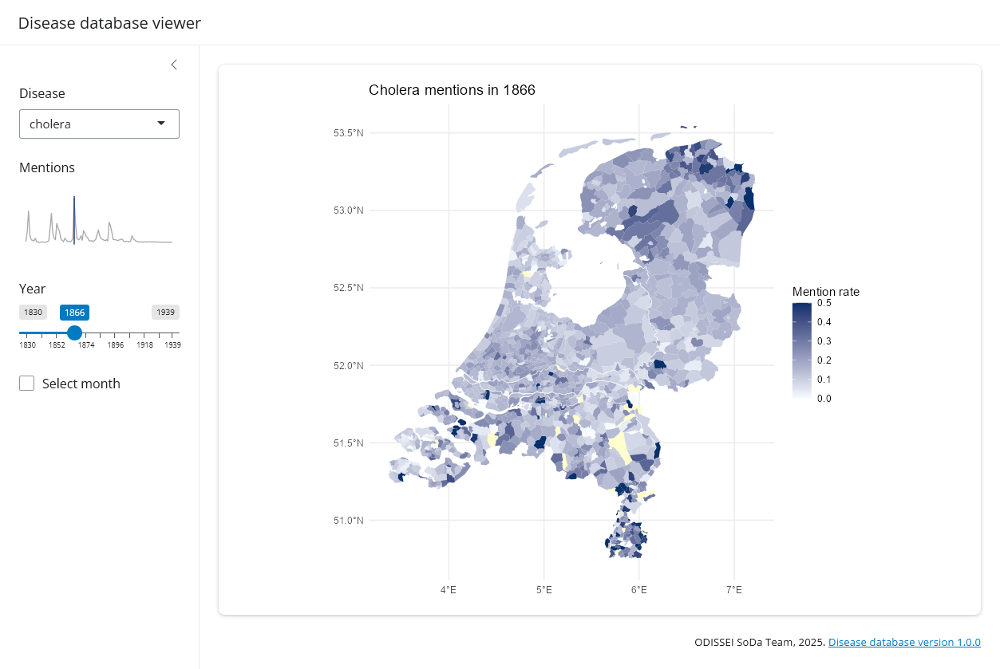

# Disease database viewer

This repository contains a basic Shiny app to interactively view our [historical disease database](https://github.com/sodascience/disease_database).



To run the app, install a recent version of R. Then, from within R, run:

```R
install.packages(c("shiny", "duckdb", "tidyverse", "sf", "glue"))
shiny::runGitHub("sodascience/disease_database_viewer")
```

## Contact
This is a project by the [ODISSEI Social Data Science (SoDa)](https://odissei-soda.nl) team.
Do you have questions, suggestions, or remarks on the technical implementation? Create an issue in the [issue tracker](https://github.com/sodascience/disease_database_viewer/issues) or feel free to contact [Erik-Jan van Kesteren](https://github.com/vankesteren).

 